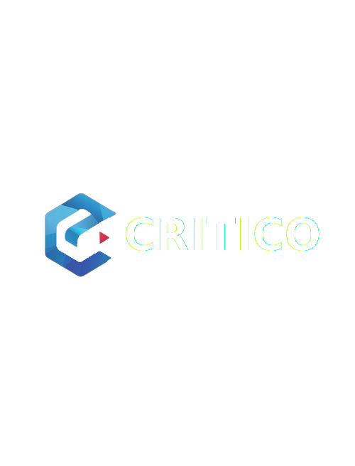

<div align="center">



# CritiRAG

<h3>
  <em>Intelligent Agent-powered document search by CritiCo</em>
</h3>

<!-- Badges -->

[](https://github.com/langflow-ai/langflow)
[](https://github.com/opensearch-project/OpenSearch)
[](https://github.com/docling-project/docling)

[](https://github.com/critico-ai/critirag/stargazers)
[](https://github.com/critico-ai/critirag/network/members)

> **Forked from [OpenRAG](https://github.com/langflow-ai/openrag)** by langflow-ai — extended and rebranded by [CritiCo](https://github.com/critico-ai).

</div>

---

CritiRAG is a comprehensive Retrieval-Augmented Generation platform that enables intelligent document search and AI-powered conversations.

Users can upload, process, and query documents through a chat interface backed by large language models and semantic search capabilities. The system utilizes Langflow for document ingestion, retrieval workflows, and intelligent nudges, providing a seamless RAG experience.

Built with [FastAPI](https://fastapi.tiangolo.com/) and [Next.js](https://github.com/vercel/next.js).
Powered by [OpenSearch](https://github.com/opensearch-project/OpenSearch), [Langflow](https://github.com/langflow-ai/langflow), and [Docling](https://github.com/docling-project/docling).

---

## ✨ Highlight Features

- **Pre-packaged & ready to run** - All core tools are hooked up and ready to go, just install and run
- **Agentic RAG workflows** - Advanced orchestration with re-ranking and multi-agent coordination
- **Document ingestion** - Handles messy, real-world data with intelligent parsing
- **Drag-and-drop workflow builder** - Visual interface powered by Langflow for rapid iteration
- **Modular enterprise add-ons** - Extend functionality when you need it
- **Enterprise search at any scale** - Powered by OpenSearch for production-grade performance

## 🔄 How CritiRAG Works

CritiRAG follows a streamlined workflow to transform your documents into intelligent, searchable knowledge:

1. **Ingest** — Upload documents via the UI or connectors (Google Drive, OneDrive, S3, IBM COS)
2. **Process** — Docling parses and chunks documents; Langflow orchestrates embedding and indexing into OpenSearch
3. **Retrieve** — Semantic + hybrid search surfaces the most relevant chunks
4. **Chat** — The LLM synthesizes retrieved context into a conversational response

## 🚀 Install CritiRAG

To get started with CritiRAG, clone this repository and follow the setup steps below.

## ✨ Quick Start

**1. Clone and set up**

```bash
git clone https://github.com/critico-ai/critirag.git
cd critirag
make setup
```

**2. Configure environment variables**

```env
OPENAI_API_KEY=
OPENSEARCH_PASSWORD=
LANGFLOW_SUPERUSER=admin
LANGFLOW_SUPERUSER_PASSWORD=
```

The `OPENSEARCH_PASSWORD` must meet [OpenSearch password complexity requirements](https://docs.opensearch.org/latest/security/configuration/demo-configuration/#setting-up-a-custom-admin-password).

**3. Start CritiRAG**

```bash
make dev      # With GPU support
make dev-cpu  # CPU only
```

CritiRAG is now running at:
- **Frontend**: http://localhost:3000
- **Langflow**: http://localhost:7860

## 📦 SDKs

Integrate CritiRAG into your applications with our official SDKs:

### Python SDK
```bash
pip install critirag-sdk
```

**Quick Example:**
```python
import asyncio
from critirag_sdk import CritiRAGClient

async def main():
    async with CritiRAGClient() as client:
        response = await client.chat.create(message="What is RAG?")
        print(response.response)

if __name__ == "__main__":
    asyncio.run(main())
```

### TypeScript/JavaScript SDK
```bash
npm install critirag-sdk
```

**Quick Example:**
```typescript
import { CritiRAGClient } from "critirag-sdk";

const client = new CritiRAGClient();
const response = await client.chat.create({ message: "What is RAG?" });
console.log(response.response);
```

## 🔌 Model Context Protocol (MCP)

Connect AI assistants like Cursor and Claude Desktop to your CritiRAG knowledge base:

```bash
pip install critirag-mcp
```

**Quick Example (Cursor/Claude Desktop config):**
```json
{
  "mcpServers": {
    "critirag": {
      "command": "uvx",
      "args": ["critirag-mcp"],
      "env": {
        "CRITIRAG_URL": "http://localhost:3000",
        "CRITIRAG_API_KEY": "your_api_key_here"
      }
    }
  }
}
```

The MCP server provides tools for RAG-enhanced chat, semantic search, and settings management.

## 🛠️ Development

For developers who want to contribute or set up a development environment, see [CONTRIBUTING.md](CONTRIBUTING.md).

## 🛟 Troubleshooting

For assistance with CritiRAG, visit the [Issues page](https://github.com/critico-ai/critirag/issues) or [Discussions page](https://github.com/critico-ai/critirag/discussions).

To report a bug or submit a feature request, visit the [Issues page](https://github.com/critico-ai/critirag/issues).

---

## 📁 Project Structure

```
critirag/
├── src/                    # Backend Python code
│   ├── api/               # REST API endpoints
│   ├── services/          # Business logic
│   ├── models/            # Data models
│   ├── connectors/        # External integrations
│   └── config/            # Configuration
├── frontend/              # Next.js frontend
│   ├── app/              # App router pages
│   ├── components/       # React components
│   └── contexts/         # State management
├── flows/                 # Langflow flow definitions
├── docs/                  # Documentation
├── tests/                 # Test files
├── Makefile              # Development commands
└── docker-compose.yml    # Container orchestration
```

---

<div align="center">
  <sub>CritiRAG is a fork of <a href="https://github.com/langflow-ai/openrag">OpenRAG</a> by langflow-ai, extended by <a href="https://github.com/critico-ai">CritiCo</a>.</sub>
</div>
